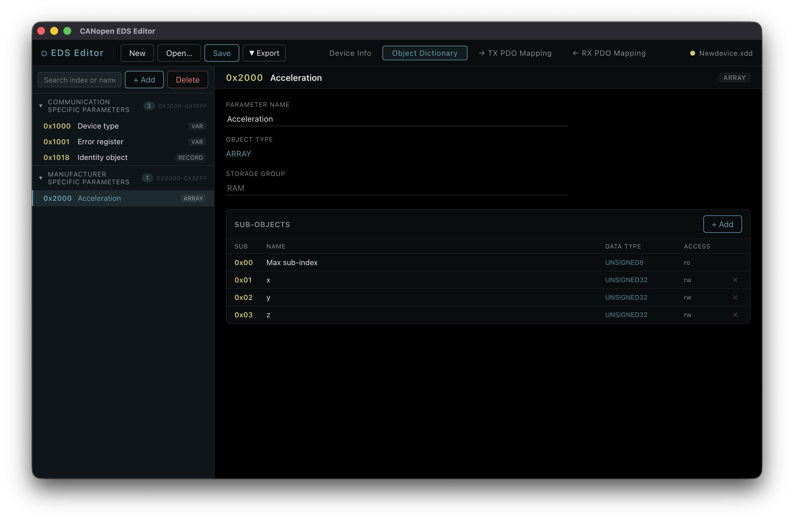
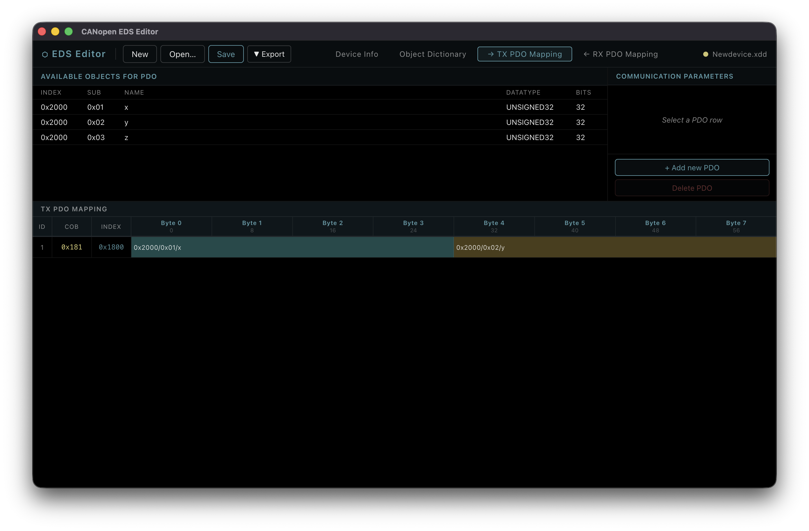

# CANopen EDS Editor

An editor for CANopen device description files. It parses, edits, and exports object
dictionaries in **EDS**, **XDD**, and **CANopenNode** (`OD.h` / `OD.c`) formats.

The app is available in two forms:

- **Web** — a client-side single-page app, deployed as a static site to GitHub Pages. Available at https://daxbot.github.io/node-canopen-editor/.
- **Desktop** — a cross-platform Electron app with native open/save dialogs and save-in-place.



## Features

- Browse and edit the object dictionary — `VAR`, `ARRAY`, and `RECORD` objects, grouped
  into communication- and manufacturer-specific ranges, with full sub-object editing.
- Edit device, file, and identity metadata.
- Visually map objects into **TX** and **RX** PDOs with a byte-level layout view.
- Import and export **EDS**, **XDD**, and **CANopenNode** `OD.h`/`OD.c` source.
- Cut / copy / paste objects within and between documents.



## Downloads

- **Web** — use it directly at [daxbot.github.io/node-canopen-editor](https://daxbot.github.io/node-canopen-editor/)
- **Desktop** — download the latest Linux, macOS, and Windows builds from the
  [desktop build workflow](https://github.com/Daxbot/node-canopen-editor/actions/workflows/desktop-build.yml):
  open the most recent successful run and grab the packaged app from its **Artifacts**.

## Usage

1. **New** starts an empty dictionary; **Open…** loads an existing `.eds` or `.xdd` file.
2. Use the tabs to move between **Device Info**, the **Object Dictionary**, and the
   **TX / RX PDO Mapping** views.
3. In the Object Dictionary, **+ Add** creates objects; selecting one edits its fields and
   sub-objects on the right.
4. In a PDO Mapping view, **+ Add new PDO** creates a PDO, then drag available objects into
   its byte layout.
5. **Save** writes back to the open file (desktop) or downloads it (web); **Export** writes
   any of the supported formats.

## Building

Requires [Node.js](https://nodejs.org) and [pnpm](https://pnpm.io).

```bash
pnpm install        # install all workspaces
pnpm dev:web        # web dev server with hot reload
pnpm dev:desktop    # Electron app in dev mode
```

Production builds:

```bash
pnpm build:web      # static site → apps/web/dist
pnpm build:desktop  # packaged app → apps/desktop/release
pnpm lint           # lint the whole repo
```

> If Electron's binary is missing after install, run its installer directly:
> `node node_modules/.pnpm/electron@*/node_modules/electron/install.js`.

## For developers

### Monorepo layout

pnpm workspaces + Turborepo, with three projects:

```
packages/renderer   # @canopen-editor/renderer — all React UI + the shared renderer
apps/web            # @canopen-editor/web — thin Vite app, GitHub Pages target
apps/desktop        # @canopen-editor/desktop — Electron app (electron-vite + electron-builder)
```

`packages/renderer` is consumed **as source** — its `package.json` `exports` point at
`src/`, and each app's Vite build transpiles it. The renderer holds a single page
(`EditorPage`) that owns all editor state; child components are presentational.

### Domain packages

All CANopen parsing, serialization, and PDO logic lives in two external dependencies:

- [`canopen-eds`](https://www.npmjs.com/package/canopen-eds) — EDS and CANopenNode formats.
- [`canopen-xdd`](https://www.npmjs.com/package/canopen-xdd) — XDD format.

These are re-exported through a single barrel, `packages/renderer/src/lib/eds/index.js`,
alongside editor-only helpers (enum maps, type predicates, PDO bit-map rendering). Import
domain functions from that barrel — never from the npm packages directly.

### Platform-abstracted file I/O

The renderer does **no** direct browser or Electron I/O. It consumes an injected
`FileService` through React context (`packages/renderer/src/platform/`). Each app provides
its own implementation:

- `apps/web` — `<input type="file">` + `FileReader` for open, `Blob` + `<a download>` for save.
- `apps/desktop` — a preload bridge over IPC to native `dialog` / `fs` in the main process.

The service covers file read/write, the object clipboard, native menus, context menus, and
dialogs. When adding a platform primitive, add it to **both** services.

See [`CLAUDE.md`](CLAUDE.md) for the full architecture notes and [`AGENTS.md`](AGENTS.md)
for the UI style guide.

## License

[MIT](LICENSE)

## About

This project was developed almost entirely with AI assistance, primarily Claude Opus.
Organizations or projects that forbid AI-generated code should treat this repository as out
of policy.
